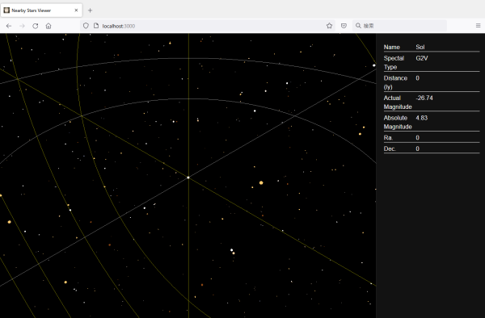

# Nearby Stars Viewer

## Overview
This app is a viewer for CSV data of ["Extended Light Century Star Catalog (tentative name)"](http://startide.jp/astro/lcc/x/) .
Main sequence stars and some dwarfs are simply colored, but other stars are not. Also, the luminous intensity is not reflected in the display.

Concentric circles drawn around the solar system have radii of 10, 20, 50, and 100 light years.

## 説明(Overview)

[「拡張光世紀星表 (仮称)」](http://startide.jp/astro/lcc/x/)のCSVデータのビューワーです。
主系列星や一部矮星については簡単に色付けしていますが、その他の星については特に色付けしていません。また、光度についても表示には反映していません。

太陽系を中心に描かれた同心円の半径は10, 20, 50, 100光年です。

## How to use

Get the CSV data from ["Extended Optical Century Star Table (tentative name)"](http://startide.jp/astro/lcc/x/) and paste the contents into `public/stars.csv`.
This application supports CSV format v2.1.

Run `$ npm run start` to start in the local environment.

## 使用方法(How to use)

[「拡張光世紀星表 (仮称)」](http://startide.jp/astro/lcc/x/)からCSVデータを取得し、`public/stars.csv`に内容をペーストしてください。
csvのフォーマットはv2.1を想定しています。

`$ npm run start`を実行するとローカル環境で起動します。

## Develop
This app is based on [create-react-app](https://github.com/facebook/create-react-app).
You can run `npm run build-prod-win` to build without sourcemap in addition to the normal build script (win only).
